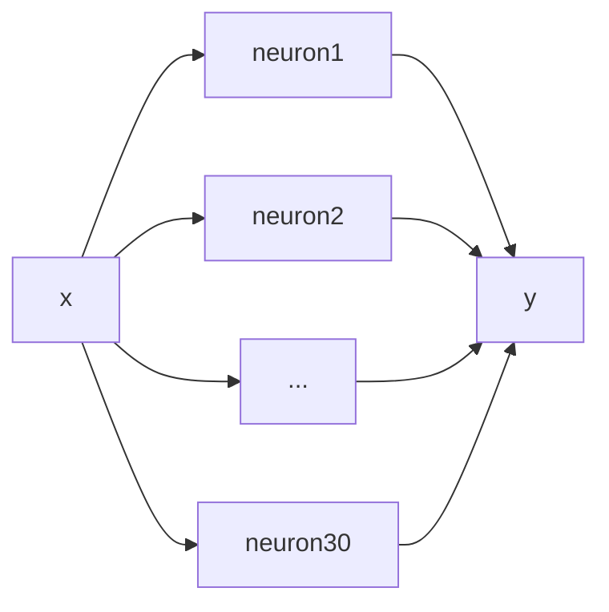
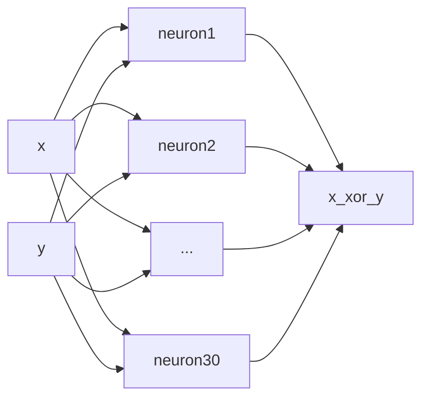

# Zadanie 11: Analiza porównawcza algorytmów do trenowania modeli sieci neuronowych.
## _Algorytmy Metaheurystyczne_
#### Zespół: _Michał Szaknis_ 300274,  _Wiktor Łazarski 281875_
[https://github.com/L0czek/Training-Neural-Networks-with-Evolution-Alg](https://github.com/L0czek/Training-Neural-Networks-with-Evolution-Alg)

[TOC]

# 1. Opis problemu

Celem projektu jest opracowanie eksperymentów, które pozwolą na porównanie różnych algorytmów ewolucyjnych w zadaniu uczenia modeli sieci neuronowych. W eksperymentach porówanamy następujące algorytmów ewolucyjne:

* Ewolucje różnicową, wariant DE/rand/1/bin
* Strategię ewolucyjną $(\mu,\lambda)$

Osobniki populacji będą przedstawione za pomocą wektora liczb zmiennoprzecisnkowych, które to będą stanowiły wagi kolejnych warst sieci neuronowych.

Dodatkowo wyniki uczenia osiągnięte przez powyższe algorytmy zestawimy z metodą stochastycznego najszybszego spadku (ang. _Stochastic Gradient Descent_).

Wynikiem naszej pracy będzie porównanie powyższych algorytmów ze względu na:
* Efektywność predykcji modelu dla nowych danych
* Szybkość uczenia modelu sieci neuronowej

# 2. Planowe eksperymenty numeryczne

W ramach eksperymentów będziemy trenować ustalaną wcześniej architekturę sieci neuronowej za pomocą opisanych wcześniej algorytmów. Model sieci neuronowej będzie się składał z 3 warstw:
* wartwy wejściowej
* warstwy ukrytej
* warstwy wyjściowej

Liczba neuronów warstwy ukrytej zostały dobrane odpowiednio dla każdego problemu i była ona stała dla każdego algorytmu trenującego.

## 2.1 Aproksymacja $F(x) = x^3-2x^2$

Eksperyment miał na celu wytrenowanie sieci neuronowej aby wykonywała aproksymację funkcji wielomianowej dla zadanego wielomianu.

#### Schemat trenowanego modelu:

W przypadku tego problemu, model sieci neuronowej miał następującą architekturę:
- ilość neuronów warstwy __wejściowej__ wynosiła __1__
- ilość neuronów warstwy __ukrytej__ wynosiła __30__
- ilość neuronów warstwy __wyjściowa__ wynosiła __1__

Na poniższych wykresach przedstawiamy przebieg funkcji straty (wykresy z lewej) oraz ostateczną aproksymacje funkcji (wykresy z prawej). Wykresy zostały wygenerowane tylko dla najlepiej dobranych parametrów, odpowiednich dla każdego algorytmów. 

Jak można zauważyć, wszystkie algorytmy porównywalnie dobrze poradziły sobie z aproksymacją funkcji wielomianowej. Z obserwacji zaprezentowanych wykresów, możemy stwierdzić, że najlepszą aproksymacją jest sieć wytrenowana przy użyciu algorytmu gradientowego spadku. Jednakże, obserwując funkcję straty, możemy stwierdzić, że proces trenowania sieci przy użyciu gradientowego spadku był bardziej "chaotyczny", niż metody ewolucyjne. Świadczą o tym przede wszystkim liczne, duże skoki, pomiędzy wartościami funkcji straty w kolejnych epokach uczenia.

## 2.2 Aproksymacja $F(x) = sin(x)+2cos(\frac{x}{3})$

W kolejnym eksperymencie postaramy się wytrenować sieć neuronową aby wykonywała aproksymację funkcji okresowej (suma sinusów). Analogicznie jak dla problemu aproksymacji funkcji wielomianowej.
#### Schemat trenowanego modelu:

W przypadku tego problemu, model sieci neuronowej miał następującą architekturę:
- ilość neuronów warstwy __wejściowej__ wynosiła __1__
- ilość neuronów warstwy __ukrytej__ wynosiła __30__
- ilość neuronów warstwy __wyjściowa__ wynosiła __1__

Analogicznie do poprzedniego punktu na poniższych wykresach przedstawiamy przebieg funkcji straty (wykresy z lewej), ostateczną aproksymacje funkcji (wykresy z prawej) oraz wykresy zostały wygenerowane tylko dla najlepiej dobranych parametrów, odpowiednich dla każdego algorytmów. 

Analizując wykresy można stwierdzić, że wszystkie metody optymalizacji niezbyt dobrze radzą sobie z trenowaniem dobranego przez nas modelu sieci neuronowej. Jednakże, według nas najlepiej zrobiła to metoda gradientowa. W kolejnych eksperymentach dobrym pomysłem byłoby dodanie kolejnych warst do modelu, co jednocześnie umożliwiłoby sieci neuronowej aproksymacje bardziej nieliniowych funkcji, jak ta z naszego eksperymentu.

## 2.3 Aproksymacja $F(x, y) = x \oplus y$

W ostatnim eksperymencie wytrenowaliśmy sieć neuronową aby wykonywała aproksymację funkcji _exclusive or (XOR)_.

#### Schemat trenowanego modelu:

W przypadku tego problemu, model sieci neuronowej miał następującą architekturę:
- ilość neuronów warstwy __wejściowej__ wynosiła __2__
- ilość neuronów warstwy __ukrytej__ wynosiła __30__
- ilość neuronów warstwy __wyjściowa__ wynosiła __1__

Analogicznie do poprzedniego punktu na poniższych wykresach przedstawiamy przebieg funkcji straty (wykresy z lewej) oraz ostateczną aproksymacje funkcji (wykresy z prawej) oraz wykresy zostały wygenerowane tylko dla najlepiej dobranych parametrów, odpowiednich dla każdego algorytmów. 

Analizując wykresy można stwierdzić, że wszystkie metody optymalizacji radzą sobie bez problemów z trenowaniem sieci neuronowej do aproksymacji funkcji XOR. Najszybciej jednak zrobiła to metoda ewolucji różnicowej, która potrzebowała tylko ~20 epok aby osiągnąć minimalną oczekiwaną wartość funkcji straty do zatrzymania dalszego uczenia. 

## Porównanie algorytmów dla najlepszych ustawień

Na poniższych wykresach przedstawiliśmy zaimplementowane przez nas algorytmy dla najlepszych ustawień odkrytych w powyższych eksperymentach.

### Aproksymacja wilomianu

### Aproksymacja funkcji sinusoidalnej

### Aproksymacja funkcji xor

Z wykresów widać, iż wszystkie metody generują podobne modele jednakże we wszystkich przypadkach metoda gradientowa okazuje się wykonywać znacznie zybciej od pozostałych.

## Ciekawa obserwacja

Podczas eksperymentów z metodą gradientową zauważyliśmy silną zależność między ilością próbek używanych jako dataset a jakością uzyskiwanych modeli. Obydwie metody heurystyczne działały dobrze nawet dla niewielkich datasetów dla każdego problemu. W przypadku metody gradientowej okazało się, iż dla problemu aproksymacji funkcji tak nie liniowej jak kombinacja funkcji sinusoidalnych potrzebna jest znacznie większa ilość próbek. Według nas jest to spowodowane faktem, iż metody heurystyczne wykorzystują próbki tylko do porównywania osobników między sobą. Natomiast metody gradientowe na podstawie próbek aproksymują kierunek zmian wartości parametrów sieci. Wtedy dla niewielu próbek kierunek wyznaczany w trakcie każdej iteracji jest znacznie bardziej losowy co wydłuża, a w skrajnych przypadkach nawet uniemożliwia uczenie.

### Dla 20 próbek

### Dla 200 próbek

### Dla 500 próbek

Na wykresach widać znacza różnice między __20__ próbkami a __200__. Przy okazji widać, iż dla tego problemu __200__ okazuje się być wartością wystarczającą, gdyż dalsze jej zwiększanie nie powoduje widocznego poprawienia się modelu a jedynie znaczne zwiększenie czasu wykonywania się algorytmu.

# Podsumowanie

Z przeprowadzonych eksperymentów wynika, że metody metaheurystyczne są znacznie bardziej odporne na małą ilość danych od metod gradientowych. Co było szczególnie zauważalne dla przypadku problemu aproksymacji funkcji sinusoidalnej. Z drugiej strony metody gradientowe okazuje się być znacznie szybsze jeśli chodzi o czas wykonania w sekundach nawet po zwiększeniu próbkowania od metod heurystycznych. Ostatecznie, jak wiadomo darmowy lunch nie istnieje i każdą metodę trzeba stosować tam gdzie radzi sobie ona lepiej. W związku z tym w przypadkach gdy dataset jest wyjątkowo mały metody heurystyczne uczenia sieci neuronowych mogą być dobrą alternatywą do metod gradientowych.